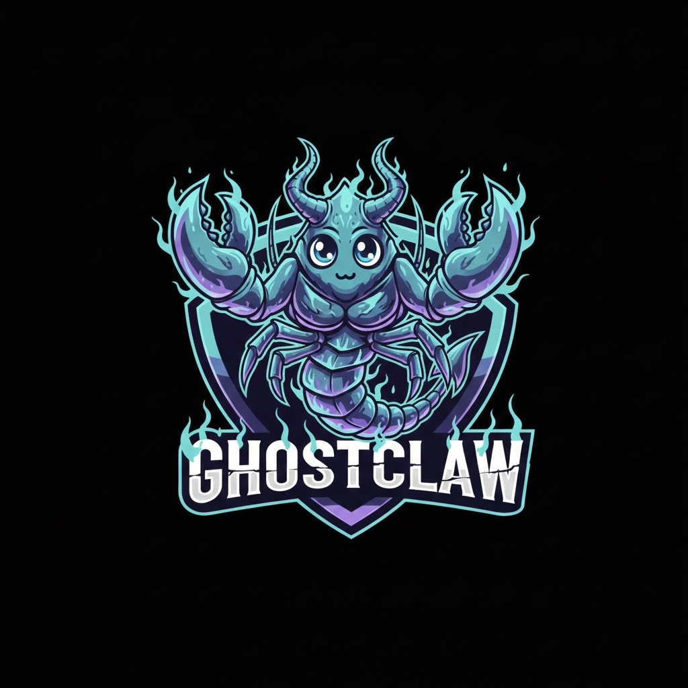

<div align="center">



# GhostClaw 🦀

</div>

<div align="center">

**Ghost Protocol. Claw Execution. Zero Compromise. 100% C++. 100% Agnostic.**

🦴 **Grandfather of OpenClaw**

⚡ Runs on $10 hardware with <5MB RAM: That's 99% less memory than OpenClaw and 98% cheaper than a Mac mini!

[](https://github.com/sudiprokaya/GhostClaw/actions)
[](LICENSE)

</div>

<div align="center">

Fast, small, and fully autonomous AI assistant infrastructure — deploy anywhere, swap anything.

`~1.9MB binary` · `~15ms warm start` · `30+ providers` · `10 traits` · `Pluggable everything`

</div>

## ✨ Features

<div align="center">

| 🪶 **Ultra-Lightweight** | ⚡ **Lightning Fast** | 🚀 **True Portability** |
|:---:|:---:|:---:|
| ~2MB peak footprint<br>~10MB RSS | 15ms warm start<br>235ms cold start | Single binary<br>ARM + x86 |

| 🔄 **Fully Swappable** | 🔓 **No Lock-in** | 🔒 **Secure by Design** |
|:---:|:---:|:---:|
| Trait-based architecture<br>Zero code changes | 30+ AI providers<br>OpenAI-compatible | Pairing + sandboxing<br>Workspace scoping |

</div>

---

## 🎯 Why Teams Pick GhostClaw

<table>
<tr>
<td width="50%">

### 🏗️ **Production Ready**
- ⚡ Small C++ binary, fast startup
- 🔒 Pairing, strict sandboxing, allowlists
- 📦 Single self-contained binary
- 🔄 Trait-based, fully swappable

</td>
<td width="50%">

### 🚀 **Feature Rich**
- 🤖 30+ AI provider integrations
- 💬 10+ real messaging channels
- 🌐 Browser automation built-in
- 🎨 Canvas, voice, TTS support

</td>
</tr>
</table>

---

## 📊 Performance

<div align="center">

*Real numbers. No marketing. Measured on MacBook Pro M3 Pro, macOS 26.2, Feb 2026.*

</div>

```
                    GhostClaw v0.1.0 — Release Build
  ─────────────────────────────────────────────────────────

  BINARY          1,989,792 bytes stripped (1.9 MB)
                  2,406,968 bytes unstripped (2.3 MB)

  STARTUP         ~15ms warm   (13.5–17.4ms, median of 20 runs)
                  ~235ms cold  (226–245ms, median of 10 cache-flushed runs)

  MEMORY          ~1.9 MB peak footprint  (process-only, --version)
                  ~4.9 MB peak footprint  (doctor, full diagnostics)
                  ~9.5 MB RSS             (includes shared system dylibs)

  ─────────────────────────────────────────────────────────
  Measured with /usr/bin/time -lp + gettimeofday() wrapper
```

<details>
<summary><b>How does this compare?</b></summary>

<br>

For context, here's how GhostClaw stacks up against other AI assistant frameworks. GhostClaw numbers are from our own measurements above. Other tools' numbers are from their published docs or our local reproduction.

**Binary size** — what you ship:
```
  OpenClaw (TS)    ██████████████████████████████████████████  ~28 MB (+ Node.js runtime)
  PicoClaw (Go)    ████████████                                ~8 MB
  ZeroClaw (Rust)  ██████                                      ~3.9 MB
  GhostClaw (C++)  ███                                         ~1.9 MB
```

**Warm startup** — repeated invocations, OS cache hot:
```
  OpenClaw (TS)    ████████████████████████████████████████████████  > 500 ms
  PicoClaw (Go)    ████████                                         < 100 ms
  NanoBot (Py)     ███                                              > 30 ms
  GhostClaw (C++)  █▌                                               ~15 ms
  ZeroClaw (Rust)  █                                                ~10 ms
```

**Cold startup** — first run after reboot, no page cache:
```
  OpenClaw (TS)    ████████████████████████████████████████████████  > 5 s
  NanoBot (Py)     █████████                                        > 1 s
  PicoClaw (Go)    ████████                                         < 1 s
  ZeroClaw (Rust)  ████                                             ~440 ms
  GhostClaw (C++)  ██                                               ~235 ms
```

**Memory (RSS)** — resident set including shared libs:
```
  OpenClaw (TS)    ████████████████████████████████████████████████  > 1 GB
  NanoBot (Py)     █████                                            > 100 MB
  PicoClaw (Go)    █                                                < 10 MB
  GhostClaw (C++)  █                                                ~10 MB
  ZeroClaw (Rust)  ▌                                                < 5 MB
```

</details>

<details>
<summary><b>Reproduce these numbers yourself</b></summary>

<br>

```bash
cmake -S . -B build -DCMAKE_BUILD_TYPE=Release
cmake --build build -j

# Binary size
strip -o ghostclaw-stripped build/ghostclaw
ls -lh ghostclaw-stripped

# Memory + timing (single run)
/usr/bin/time -lp ./build/ghostclaw --version

# Warm start (run a few times to warm cache, then measure 20)
for i in {1..20}; do /usr/bin/time -lp ./build/ghostclaw --version 2>&1 | grep "^real"; done

# Cold start (macOS — requires sudo)
sudo purge && /usr/bin/time -lp ./build/ghostclaw --version
```

**Warm** = 20 consecutive runs, median. **Cold** = fresh binary copy + 512MB random write to flush page cache between runs, median of 10. RSS and footprint from `/usr/bin/time -lp`.

</details>

---

## 🚀 Quick Start

```bash
git clone https://github.com/sudiprokaya/GhostClaw.git
cd GhostClaw
cmake -S . -B build -DCMAKE_BUILD_TYPE=Release
cmake --build build -j

# Just run it — the setup wizard launches automatically on first run
./build/ghostclaw
```

<div align="center">

**The wizard walks you through provider, model, API key, memory, channels, and skills in 7 steps,<br>then offers to drop you straight into the agent.**

</div>

### 💡 Usage Examples

```bash
# Skip the wizard entirely with flags
ghostclaw onboard --provider openrouter --api-key sk-...

# Single message
ghostclaw agent -m "Hello, GhostClaw!"

# Interactive chat
ghostclaw agent

# Start the gateway (webhook server)
ghostclaw gateway

# Start full autonomous daemon
ghostclaw daemon

# Diagnostics
ghostclaw status
ghostclaw doctor
```

### 🐳 Docker

```bash
docker build -t ghostclaw .
docker run --rm ghostclaw --help
docker run -d --name ghostclaw-daemon -p 8080:8080 ghostclaw daemon --host 0.0.0.0 --port 8080
```

---

## 🏗️ Architecture

<div align="center">

**Every subsystem is a trait — swap implementations with a config change, zero code changes.**

</div>

| Subsystem | Trait | Ships with | Extend |
|-----------|-------|------------|--------|
| 🤖 **AI Models** | Provider | 30+ providers (OpenRouter, Anthropic, OpenAI, Google, Ollama, Groq, Cerebras, Mistral, xAI, DeepSeek, Together, Fireworks, NVIDIA, Cloudflare, HuggingFace, etc.) | `custom:https://your-api.com` — any OpenAI-compatible API |
| 💬 **Channels** | Channel | CLI, Telegram, Discord, Slack, iMessage, Matrix, WhatsApp, Signal, Webhook | Any messaging API |
| 🧠 **Memory** | Memory | SQLite with hybrid search (FTS5 + vector cosine similarity), Markdown | Any persistence backend |
| 🛠️ **Tools** | Tool | shell, file_read, file_write, memory_store, memory_recall, memory_forget, browser_open, web_search, canvas | Any capability |
| 📊 **Observability** | Observer | Noop, Log, Multi | Prometheus, OTel |
| ⚙️ **Runtime** | RuntimeAdapter | Native (Mac/Linux) | Docker (planned) |
| 🔒 **Security** | SecurityPolicy | Gateway pairing, sandbox, allowlists, rate limits, filesystem scoping, encrypted secrets | — |
| 👤 **Identity** | IdentityConfig | OpenClaw (markdown), AIEOS v1.1 (JSON) | Any identity format |
| 🌐 **Tunnel** | Tunnel | None, Cloudflare, Tailscale, ngrok, Custom | Any tunnel binary |
| 🎯 **Skills** | Loader | TOML manifests + SKILL.md instructions | Community skill packs |

---

## 🧠 Memory System

<div align="center">

**All custom, zero external dependencies — no Pinecone, no Elasticsearch, no LangChain**

</div>

| Layer | Implementation |
|-------|----------------|
| **Vector DB** | Embeddings stored as BLOB in SQLite, cosine similarity search |
| **Keyword Search** | FTS5 virtual tables with BM25 scoring |
| **Hybrid Merge** | Custom weighted merge function |
| **Embeddings** | EmbeddingProvider trait — OpenAI, local, or noop |
| **Chunking** | Line-based markdown chunker with heading preservation |
| **Caching** | SQLite embedding_cache table with LRU eviction |

```toml
[memory]
backend = "sqlite"          # "sqlite", "markdown", "none"
auto_save = true
embedding_provider = "openai"
vector_weight = 0.7
keyword_weight = 0.3
```

---

## 🔒 Security

<div align="center">

**GhostClaw enforces security at every layer**

</div>

| # | Item | Status | How |
|---|------|:------:|-----|
| 1 | Gateway not publicly exposed | ✅ | Binds 127.0.0.1 by default. Refuses 0.0.0.0 without tunnel or explicit `allow_public_bind = true` |
| 2 | Pairing required | ✅ | 6-digit one-time code on startup. Exchange via POST /pair for bearer token |
| 3 | Filesystem scoped | ✅ | `workspace_only = true` by default. System dirs blocked. Symlink escape detection |
| 4 | Access via tunnel only | ✅ | Gateway refuses public bind without active tunnel |

---

## ⚙️ Configuration

<div align="center">

Config: `~/.ghostclaw/config.toml` (created automatically on first run)

</div>

<details>
<summary>📝 <b>View Example Configuration</b></summary>

```toml
api_key = "sk-..."
default_provider = "openrouter"
default_model = "anthropic/claude-sonnet-4-20250514"
default_temperature = 0.7

[memory]
backend = "sqlite"
auto_save = true
embedding_provider = "openai"

[gateway]
require_pairing = true
allow_public_bind = false

[autonomy]
level = "supervised"            # "readonly", "supervised", "full"
workspace_only = true
allowed_commands = ["git", "npm", "cargo", "ls", "cat", "grep"]

[tunnel]
provider = "none"               # "none", "cloudflare", "tailscale", "ngrok", "custom"

[secrets]
encrypt = true

[browser]
enabled = false
allowed_domains = ["docs.rs"]
```

</details>

<div align="center">

📚 **Full reference:** [docs/CONFIGURATION.md](docs/CONFIGURATION.md)

</div>

---

## 🎮 Commands

<table>
<tr>
<td width="50%">

### Core Commands

| Command | Description |
|---------|-------------|
| *(no args, first run)* | Auto-launches 7-step wizard |
| `onboard` | Re-run setup wizard |
| `onboard --provider X` | Non-interactive setup |
| `agent` | Interactive chat mode |
| `agent -m "..."` | Single message mode |
| `gateway` | Start HTTP gateway |
| `daemon` | Start autonomous daemon |

</td>
<td width="50%">

### Management Commands

| Command | Description |
|---------|-------------|
| `service install/start/stop` | Manage background service |
| `doctor` | Run diagnostics checks |
| `status` | Show system status |
| `channel doctor` | Check channel health |
| `cron` | Manage scheduler jobs |
| `skills` | Manage skill packages |
| `tts` | Text-to-speech providers |
| `voice` | Wake-word utilities |
| `integrations` | Browse registry |

</td>
</tr>
</table>

---

## 🛠️ Development

```bash
# Debug build + tests
cmake -S . -B build -DCMAKE_BUILD_TYPE=Debug
cmake --build build -j
ctest --test-dir build --output-on-failure

# Release build
cmake -S . -B build-release -DCMAKE_BUILD_TYPE=Release
cmake --build build-release -j

# Run benchmarks
./build/benches/ghostclaw_benchmarks
```

---

## 🤝 Contributing

<div align="center">

See [CONTRIBUTING.md](CONTRIBUTING.md). Implement a trait, submit a PR:

</div>

<table>
<tr>
<td width="50%">

- 🤖 **New Provider** → `src/providers/`
- 💬 **New Channel** → `src/channels/`
- 📊 **New Observer** → `src/observability/`
- 🛠️ **New Tool** → `src/tools/`

</td>
<td width="50%">

- 🧠 **New Memory** → `src/memory/`
- 🌐 **New Tunnel** → `src/tunnel/`
- 🎯 **New Skill** → `~/.ghostclaw/workspace/skills/<name>/`

</td>
</tr>
</table>

---

## 📄 License

<div align="center">

MIT — see [LICENSE](LICENSE)

</div>

---

<div align="center">

**GhostClaw — Ghost Protocol. Claw Execution. Zero Compromise.** 🦀

</div>
